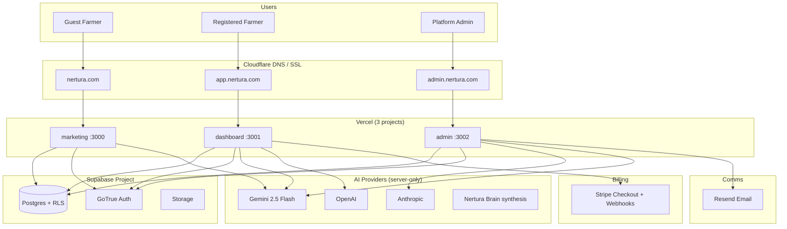
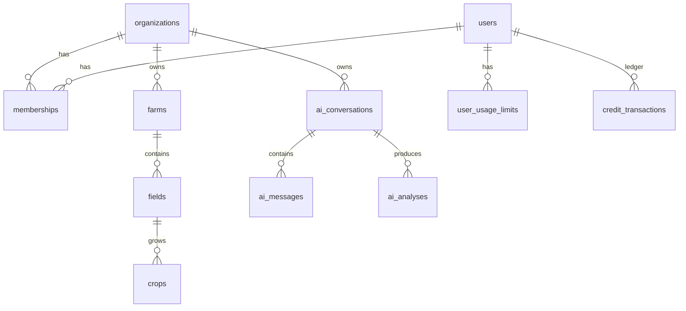
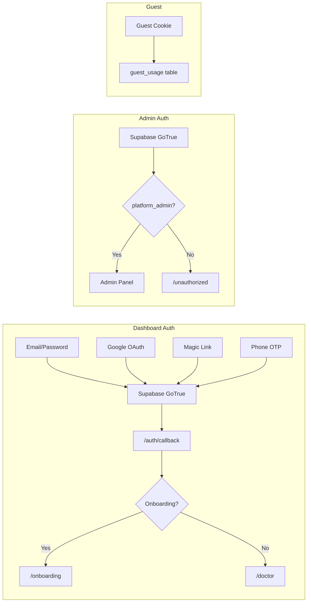
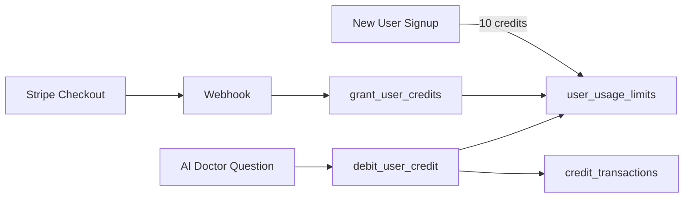

# Nertura Architecture Bible

> **Superseded for engineering standards by [Foundation Book 03 — Engineering Standards](foundation/03-engineering-standards/)** (June 2026).  
> This file remains the deep technical topology reference. When they conflict, **Foundation wins**, then **code**.

> Code wins over older docs when they disagree. Last updated: June 2026.  
> **Canonical index:** [`foundation/README.md`](foundation/README.md)

---

## 0. What Nertura Is

**Nertura is the AI Brain for Agriculture** — a trusted global AI Agriculture Intelligence Platform. It is not only a plant-photo diagnosis app, farm software, CRM, or content tool.

**Product manifesto (canonical UX & safety direction):** [`docs/NERTURA_PRODUCT_MANIFESTO.md`](NERTURA_PRODUCT_MANIFESTO.md)

**Four intelligence layers:**

| Layer | Purpose |
|-------|---------|
| **AI Doctor** | User-facing doctor — questions, photos, diagnosis, follow-up, field cases (via `runIntelligenceEngine`) |
| **Field Intelligence** | Each field = digital patient file — boundary, area, history, cases, recommendations |
| **Knowledge Intelligence** | Verified Knowledge Bank + research layer, citations, human review |
| **Growth Intelligence** | Content + outreach + SEO drafts — **approval-only**, never auto-send/publish |

**Platform capabilities (implemented or scaffolded):**

- **AI Doctor** — crop disease diagnosis and guidance (never raw Gemini)
- **Farm Memory** — fields, farms, crops, and ongoing case history
- **Geo Intelligence** — Mapbox field boundaries, forward geocoding, area in m² / dönüm / ha
- **Trusted Knowledge Bank** — ingested sources, citations, human review for risky claims
- **Weather / Soil / Satellite** — API-ready placeholders on the map
- **CRM / Outreach** — lead pipeline with founder approval; no auto-send
- **AI Content Engine** — multi-channel drafts in review queue; no auto-publish
- **Marketplace** — **future placeholder only** — Nertura does not sell ag inputs (neutral advisor)

**Dual UX model (foundation pass):**

| User | First experience |
|------|------------------|
| **Guest / new** (marketing) | Google-like AI Doctor composer — ask, upload photo, short-first answers |
| **Logged-in** (dashboard) | Field-first Agriculture OS (RC-2) — fields, cases, recommendations; AI Doctor one click away |
| **Deep path** | Natural-language intake → confirm → map → boundary → field case → Doctor with context |

Each **field** is a patient file; each crop problem is an **ongoing field case** (`field_cases`: open → monitoring → resolved → archived).

**Answer format (AI Doctor):** short diagnosis first, expandable sections — see `packages/ai/src/answer-formatter.ts` and manifesto § AI Doctor Rules.

**Language:** TR + EN for AI answers today; full UI i18n scaffold documented in manifesto § Global / Language Strategy.

**Safety rules:**

| Domain | Rule |
|--------|------|
| AI Doctor | Always `runIntelligenceEngine` — user context + Knowledge Bank + memory + evidence |
| Knowledge Bank | New items `review_pending`; no auto-approval; no auto pesticide dosage publishing |
| Outreach | Founder approval required; `do_not_contact` and unsubscribe respected; every send logged |
| Content | All outputs to draft/review queue; no auto-publish |
| Premium reports | Credit costs defined (60–100+); disabled until `NEXT_PUBLIC_PREMIUM_REPORTS_ENABLED=true` |
| Dev cache | After `pnpm build`, restart with `pnpm dev:fresh` — never dev on production `.next` |

**Release candidate:** RC-2 closed (June 2026) — field-centric logged-in experience. **Foundation pass** aligns product manifesto with code. See [`docs/NERTURA_PRODUCT_MANIFESTO.md`](NERTURA_PRODUCT_MANIFESTO.md), [`docs/SPRINT_RC2_FIELD_INTELLIGENCE.md`](SPRINT_RC2_FIELD_INTELLIGENCE.md), [`docs/SPRINT_RC1_BETA_READINESS.md`](SPRINT_RC1_BETA_READINESS.md).

---

## 1. Monorepo Map

```
Nertura/
├── apps/
│   ├── marketing/     @nertura/marketing   :3000   nertura.com
│   ├── dashboard/     @nertura/dashboard   :3001   app.nertura.com
│   └── admin/         @nertura/admin       :3002   admin.nertura.com
├── packages/
│   ├── ai/            @nertura/ai           Intelligence engine (server-only)
│   ├── ui/            @nertura/ui           Shared React + Tailwind design system
│   ├── types/         @nertura/types         Domain + DB TypeScript types
│   ├── utils/         @nertura/utils         slugify, URLs, helpers
│   ├── geo/           @nertura/geo            Map providers, geometry, regional API interfaces
│   └── typescript-config/
├── supabase/
│   ├── migrations/    30+ SQL migrations (source of truth for schema)
│   ├── policies/      RLS policy fragments
│   └── seed/          Demo seed data
├── docs/              Strategy, compliance, and architecture specs
└── scripts/           test-gemini.ts, tooling
```

| Tool | Role |
|------|------|
| **pnpm 9** | Workspace package manager |
| **Turborepo 2** | `dev`, `build`, `lint`, `typecheck` across packages |
| **Next.js 15** | App Router on all three apps |
| **React 19** | UI runtime |
| **Supabase** | Postgres 15, Auth, Storage, RLS |
| **TypeScript 5.7** | End-to-end type safety |

**Local dev:** `pnpm dev` starts all three apps via Turbo.

---

## 2. System Topology



---

## 3. The Three Apps

### 3.1 Marketing — `@nertura/marketing`

| | |
|---|---|
| **Domain** | `nertura.com` |
| **Port** | 3000 |
| **Auth** | None (public) |
| **Purpose** | Homepage, guest AI Doctor, legal pages, SEO |

**Key routes**

| Route | Purpose |
|-------|---------|
| `/` | Centered hero + guest AI Doctor (3 free questions) |
| `/[slug]` | Legal pages (privacy, terms, GDPR, KVKK, etc.) |
| `POST /api/doctor` | Guest diagnosis pipeline |
| `GET/POST /api/doctor/conversations` | Guest conversation persistence |

**Guest limits:** 3 questions (`GUEST_QUESTION_LIMIT` in `@nertura/ai`). After limit → signup CTA to dashboard.

**Files:** `apps/marketing/src/components/home-doctor-form.tsx`, `apps/marketing/src/app/api/doctor/route.ts`

---

### 3.2 Dashboard — `@nertura/dashboard`

| | |
|---|---|
| **Domain** | `app.nertura.com` |
| **Port** | 3001 |
| **Auth** | Supabase SSR + middleware |
| **Purpose** | Authenticated AI Doctor, farms, credits, onboarding |

**Navigation (implemented)**

Plant Doctor · History · My Farm · Fields · Crops · Credits · Account · Settings · Logout

**Key routes**

| Route | Purpose |
|-------|---------|
| `/doctor` | Full-screen ChatGPT-style AI Doctor |
| `/onboarding` | 6-step Agriculture Intelligence Setup |
| `/history` | Past AI analyses |
| `/farms`, `/fields`, `/crops` | Operational CRUD |
| `/account` | Profile, credits, Stripe checkout |
| `/settings` | Preferences, data export links |
| `POST /api/ai/doctor` | Authenticated diagnosis (credit debit) |
| `POST /api/billing/checkout` | Stripe session |
| `POST /api/webhooks/stripe` | Credit grant (idempotent) |
| `POST /api/onboarding/complete` | Atomic onboarding RPC |
| `GET /auth/callback` | OAuth code exchange |

**Middleware:** `apps/dashboard/src/lib/supabase/middleware.ts`  
- Unauthenticated → `/login`  
- No onboarding → `/onboarding`  
- OAuth callback → onboarding or `/doctor`

**Files:** `apps/dashboard/src/lib/ai/doctor-service.ts`, `apps/dashboard/src/lib/auth/context.ts`

---

### 3.3 Admin — `@nertura/admin`

| | |
|---|---|
| **Domain** | `admin.nertura.com` |
| **Port** | 3002 |
| **Auth** | Supabase + `platform_admin` role |
| **Purpose** | Platform control center |

**Role gate:** `user.app_metadata.role === 'platform_admin'`  
(`apps/admin/src/lib/auth/platform-admin.ts`)

**Dev bypass:** `ADMIN_AUTH_DISABLED=true` — **forbidden in production**.

**Nav groups (implemented)**

| Group | Modules |
|-------|---------|
| Dashboard | Overview |
| Users | Users, Organizations |
| AI | Analyses, Conversations, Knowledge Bank, Intelligence Center, Provider Outputs, Feedback, Memory Events, Similar Cases, Knowledge Gaps, AI Logs |
| Growth | Outreach, Mail CRM, Content Engine |
| Billing | Usage, Transactions |
| Security | Audit Logs, Settings, Data Import |

**Cron:** `GET /api/cron/outreach-weekly` — requires `Authorization: Bearer $CRON_SECRET`. Never auto-sends outreach emails.

**Files:** `apps/admin/src/components/admin-shell.tsx`, `apps/admin/src/lib/outreach/*`

---

## 4. Shared Packages

### `@nertura/ai` — Intelligence Engine

**Server-only.** Never import from client components.

```
packages/ai/src/
├── intelligence-engine.ts    runIntelligenceEngine() — main orchestrator
├── knowledge-bank-doctor.ts  KB search → Gemini → synthesis (threshold 0.78)
├── knowledge-search.ts       FTS/hybrid on knowledge_items
├── intent-classifier.ts      Agriculture intent detection
├── entity-extractor.ts       Crops, diseases, pests, location from text
├── farm-profile.ts           Onboarding farm context for prompts
├── gemini.ts                 Gemini 2.5 Flash (primary provider)
├── openai.ts                 OpenAI fallback / assistant
├── brain.ts                  Nertura Brain synthesis layer
├── evidence-cards.ts         UI evidence card builder
├── similar-case-ranking.ts   Outcome-adjusted confidence
└── types.ts                  GUEST_QUESTION_LIMIT=3, REGISTERED_FREE_LIMIT=10
```

**Pipeline flow (every doctor answer):**

```mermaid
sequenceDiagram
  participant U as User Question
  participant IE as Intelligence Engine
  participant INT as Intent + Entities
  participant KB as Knowledge Bank
  participant FP as Farm Profile
  participant GM as Gemini
  participant MEM as Memory / Similar Cases
  participant EC as Evidence Cards

  U --> IE
  IE --> INT
  IE --> KB
  IE --> FP
  alt KB score >= 0.78
    KB --> EC
  else Combined path
    KB --> GM
    FP --> GM
    GM --> EC
  end
  IE --> MEM
  IE --> EC
```

**Answer structure (target format):**

1. Short Answer  
2. Diagnosis / Assessment  
3. Risk Level  
4. Immediate Action  
5. Treatment Plan  
6. Prevention  
7. Why Nertura Thinks This (evidence cards)  
8. Follow-up Questions  
9. Disclaimer  

---

### `@nertura/ui` — Design System

Nertura brand colors (do not redesign):

| Token | Value | Usage |
|-------|-------|-------|
| `signal` | `#2DDAAF` | Primary green accent |
| `void` | `#0B1220` | Dark brand / headings |
| CSS vars | Light/dark mode | `--background`, `--primary`, etc. |

Components: AI chat shell, composer, doctor answer card, evidence panels, theme provider, dropdown menus.

**File:** `packages/ui/src/styles/globals.css`, `packages/ui/tailwind.config.ts`

---

### `@nertura/types` — Domain Types

Shared TypeScript types: `DoctorDiagnosis`, database row shapes, `OrganizationType`, enums.

---

### `@nertura/utils` — Helpers

`slugify`, URL helpers — used in onboarding and org creation.

---

## 5. Data Architecture

**Single Supabase Postgres project** per environment. All apps share one database with RLS tenant isolation.

### 5.1 Core tenant model



| Table | Purpose |
|-------|---------|
| `organizations` | Tenant root; `settings.onboarding_profile` JSON |
| `users` | Profile; `onboarding_completed_at` |
| `memberships` | User ↔ org RBAC (`owner`, `admin`, `manager`, …) |
| `farms` | Geo, area, address JSON, site type metadata |
| `fields` | PostGIS boundary, soil metadata |
| `crops` | Crop seasons per field |
| `ai_conversations` | Threads (user or guest) |
| `ai_messages` | Message history |
| `ai_analyses` | Structured diagnoses |
| `knowledge_items` | Searchable knowledge bank |
| `user_usage_limits` | `credits_balance`, question counts |
| `credit_transactions` | Immutable ledger |
| `guest_usage` | Guest question counter |
| `ai_memory_events` | Per-diagnosis memory graph |
| `ai_provider_outputs` | Raw provider responses |
| `ai_feedback` | User thumbs up/down |
| `diagnosis_outcomes` | 7/14/30 day follow-up outcomes |
| `leads` | Outreach CRM leads |
| `email_log` | Draft → approved → sent trail |
| `media_content_queue` | Content engine queue |

### 5.2 Critical RPCs

| RPC | Purpose |
|-----|---------|
| `complete_onboarding_setup()` | Atomic org + farm + field + crops + onboarding complete |
| `debit_user_credit()` | −1 credit per AI question + ledger row |
| `grant_user_credits()` | Stripe/admin/signup credit grants (idempotent) |
| `create_organization_with_owner()` | Legacy single-step org (superseded by full onboarding) |

**Migrations:** `supabase/migrations/` — apply with `pnpm supabase:push`

### 5.3 RLS

Row Level Security enforced on all tenant tables. Users see only their org's data via `memberships`. Admin uses service role server-side only.

**Verify:** `pnpm supabase:verify:rls`

---

## 6. Authentication Architecture



| Surface | Mechanism | Gate |
|---------|-----------|------|
| Marketing | None | 3-question guest limit |
| Dashboard | Supabase SSR cookies | Membership + onboarding |
| Admin | Supabase SSR + metadata role | `platform_admin` only |

**OAuth setup:** `docs/google-oauth-setup.md`  
**Never expose:** `SUPABASE_SERVICE_ROLE_KEY`, `GEMINI_API_KEY`, `STRIPE_SECRET_KEY` in `NEXT_PUBLIC_*`

---

## 7. Onboarding Intelligence

**6-step wizard** at `/onboarding`:

1. Welcome  
2. Organization (name, slug, type)  
3. Location & Region (country, city, district, coordinates, map placeholder)  
4. Site (field / greenhouse / orchard, area)  
5. Crops (multi-select)  
6. Confirm & Start (intelligence module previews)  

**Persistence:** `POST /api/onboarding/complete` → RPC `complete_onboarding_setup`

**After onboarding:** `loadFarmIntelligenceProfile()` injects location, crops, site type into every AI Doctor prompt via `formatFarmProfileForPrompt()`.

**Files:** `apps/dashboard/src/components/onboarding/onboarding-wizard.tsx`, `apps/dashboard/src/lib/onboarding/farm-profile-loader.ts`

---

## 8. Credit Economy



| Event | Credits |
|-------|---------|
| Signup bonus | +10 |
| AI Doctor question | −1 |
| Guest marketing question | Free (3 max, separate counter) |

**Credit packages (Stripe):**

| Pack | Credits | Price |
|------|---------|-------|
| starter | 100 | $9.99 |
| pro | 500 | $29.99 |
| business | 2000 | $99.99 |

**Central service:** `apps/dashboard/src/lib/credits/service.ts` — feature cost map for future services (satellite, regional report, content gen, etc.)

**Files:** `apps/dashboard/src/app/api/billing/checkout/route.ts`, `apps/dashboard/src/app/api/webhooks/stripe/route.ts`

---

## 9. Admin Operations

### 9.1 Outreach CRM

**Rule:** Never auto-send. Founder must approve every email.

| Stage | Status |
|-------|--------|
| Lead discovery | SerpAPI / manual → `leads` table |
| Draft generation | Anthropic (if key) or manual → `email_log` status `draft` |
| Founder review | `/outreach` UI — approve / reject / edit |
| Send | Resend (if configured) → only `approved` rows |
| Compliance | `do_not_contact`, `unsubscribe_token` |

**Weekly cron:** Finds leads, generates drafts, notifies admin — does **not** send.

### 9.2 Content Engine

**Table:** `media_content_queue`  
**Platforms:** Instagram, TikTok, YouTube Shorts, Blog, LinkedIn, X  
**Status flow:** idea → draft → approved → ready → published  
**Generation:** Gemini (when configured) — no auto-post yet.

### 9.3 Intelligence Center

Read-only observability over `ai_memory_events`, `ai_provider_outputs`, `diagnosis_outcomes`, `similar_cases`, knowledge gaps.

---

## 10. Security Model

| Layer | Implementation |
|-------|----------------|
| Transport | HTTPS everywhere (Cloudflare + Vercel) |
| Auth | Supabase GoTrue + SSR cookies |
| Authorization | RLS + middleware + role checks |
| Admin | `platform_admin` metadata; no bypass in prod |
| Cron | `CRON_SECRET` Bearer token |
| Webhooks | Stripe signature verification |
| Uploads | JPG/PNG/WebP only, 5 MB max |
| Rate limits | API route rate limiting (marketing + dashboard) |
| Headers | X-Frame-Options, nosniff, Referrer-Policy (next.config) |
| Secrets | Server env only; never `NEXT_PUBLIC_*` for keys |

**Audit:** `audit_logs` table + admin security logs view.

---

## 11. Deployment Architecture

| App | Vercel root | Domain |
|-----|-------------|--------|
| marketing | `apps/marketing` | nertura.com |
| dashboard | `apps/dashboard` | app.nertura.com |
| admin | `apps/admin` | admin.nertura.com |

**Build:** `pnpm --filter @nertura/<app> build`  
**Migrations:** `pnpm supabase:push` before deploy  
**Full guide:** `docs/production-deploy.md`

### Environment tiers

| Tier | Supabase | Purpose |
|------|----------|---------|
| Local | `supabase start` (:54321) | Development |
| Staging | Separate project | Pre-prod QA |
| Production | Separate project | Live users |

---

## 12. Future Integrations (Architected, Not Live)

These are **placeholder-ready** — do not fake live data:

| Integration | Status | Where wired |
|-------------|--------|-------------|
| Mapbox maps | **Sprint 1A** — `MapView` + `@nertura/geo` abstraction; onboarding still uses CSS placeholder | `packages/geo`, `packages/ui/map-view`, `/farms/[id]/map` |
| Reverse geocoding | Mapbox when token set; stub otherwise | `@nertura/geo/providers` |
| Open-Meteo weather | Stub provider; table + prompts ready | `@nertura/geo/providers`, `memory-engine.ts` |
| Satellite / NDVI | Stub provider; layer slot on map | `MapView.layerControls`, onboarding |
| Soil API | Stub provider | `@nertura/geo/providers` |
| Regional disease model | KB + farm + **selected field** context | `farm-profile-loader`, Plant Doctor |

---

## 13. SEO & Growth Architecture

**Implemented:** metadata, sitemap, robots, JSON-LD, legal pages, hreflang placeholders.

**Future routes (not built):** `/blog`, `/plant-diseases`, `/crops`, `/tr`, `/en`

**Spec:** `docs/seo-engine-spec.md`

---

## 14. Code Entry Points (Quick Reference)

| Concern | File |
|---------|------|
| Guest AI Doctor | `apps/marketing/src/app/api/doctor/route.ts` |
| Auth AI Doctor | `apps/dashboard/src/app/api/ai/doctor/route.ts` |
| Doctor orchestration | `apps/dashboard/src/lib/ai/doctor-service.ts` |
| Intelligence engine | `packages/ai/src/intelligence-engine.ts` |
| Farm context | `apps/dashboard/src/lib/onboarding/farm-profile-loader.ts` |
| Dashboard auth | `apps/dashboard/src/lib/supabase/middleware.ts` |
| Admin auth | `apps/admin/src/lib/supabase/middleware.ts` |
| OAuth callback | `apps/dashboard/src/app/auth/callback/route.ts` |
| Onboarding RPC | `supabase/migrations/20250701000000_onboarding_intelligence_setup.sql` |
| Stripe webhook | `apps/dashboard/src/app/api/webhooks/stripe/route.ts` |
| Outreach send | `apps/admin/src/app/api/outreach/send/route.ts` |
| Credit debit | `apps/dashboard/src/lib/credits/service.ts` |
| NL farm intake parser | `packages/ai/src/farm-intake-parser.ts` |
| Intake UI | `apps/dashboard/src/app/(dashboard)/intake/page.tsx` |
| Field cases | `supabase/migrations/20250706000000_field_cases.sql` |
| Field map UX | `apps/dashboard/src/components/farm/farm-map-client.tsx` |
| Premium reports scaffold | `apps/dashboard/src/lib/credits/premium-reports.ts` |
| Content engine generate | `apps/admin/src/app/api/content-engine/generate/route.ts` |
| Outreach Resend status | `apps/admin/src/app/api/outreach/status/route.ts` |

---

## 15. Document Authority

When specs conflict:

```
1. founder-decisions.md
2. NERTURA_PRODUCT_MANIFESTO.md     ← product UX, safety, growth rules (what users experience)
3. mvp-definition.md
4. Compliance & security policies
5. THIS DOCUMENT (code-aligned architecture)
6. Domain specs in docs/
7. Wireframes / UI specs
```

**Related docs:**

| Doc | Topic |
|-----|-------|
| [`NERTURA_PRODUCT_MANIFESTO.md`](NERTURA_PRODUCT_MANIFESTO.md) | **Product direction** — UX ladder, four layers, safety, marketplace rule |
| [`production-deploy.md`](production-deploy.md) | Vercel deploy checklist |
| [`google-oauth-setup.md`](google-oauth-setup.md) | OAuth redirect URLs |
| [`auth-architecture.md`](auth-architecture.md) | Auth deep dive |
| [`nertura-brain-architecture.md`](nertura-brain-architecture.md) | Brain / AgOS vision |
| [`payment-billing-system.md`](payment-billing-system.md) | Stripe + credits |
| [`database-blueprint.md`](database-blueprint.md) | Full ER (aspirational) |
| [`security-master-plan.md`](security-master-plan.md) | 14 security layers |
| [`OVERNIGHT_SPRINT_REPORT.md`](OVERNIGHT_SPRINT_REPORT.md) | Latest production status |

**Master index:** [`nertura-index.md`](nertura-index.md)

---

## 16. Naming: Docs vs Code

Older docs may reference planned names. **Implemented code uses:**

| Old / planned | Actual |
|---------------|--------|
| `apps/web` | `apps/marketing` |
| `apps/app` | `apps/dashboard` |
| `@nertura/db` | `@nertura/types` + Supabase client |
| `@nertura/brain-client` | `@nertura/ai` |

---

*Nertura Architecture Bible — maintained as the single technical map of the platform. Update this document when architecture changes.*
