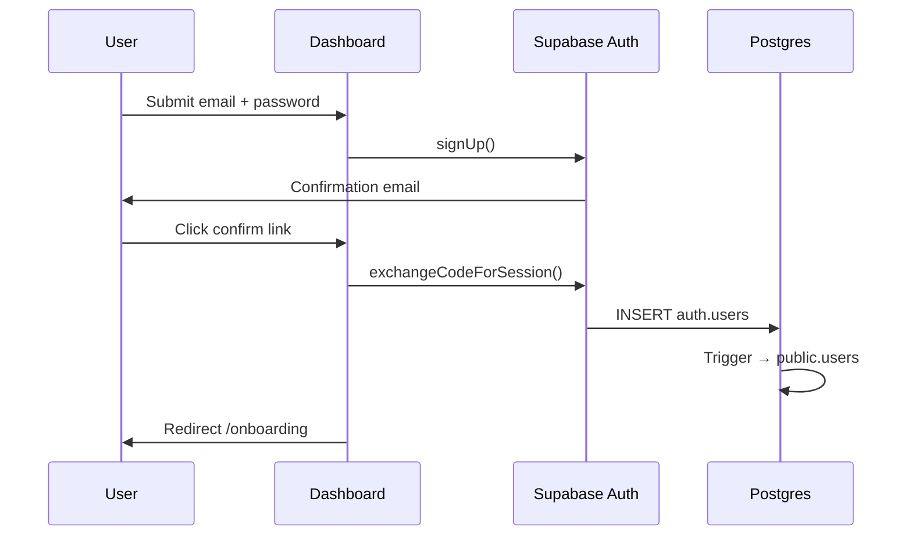
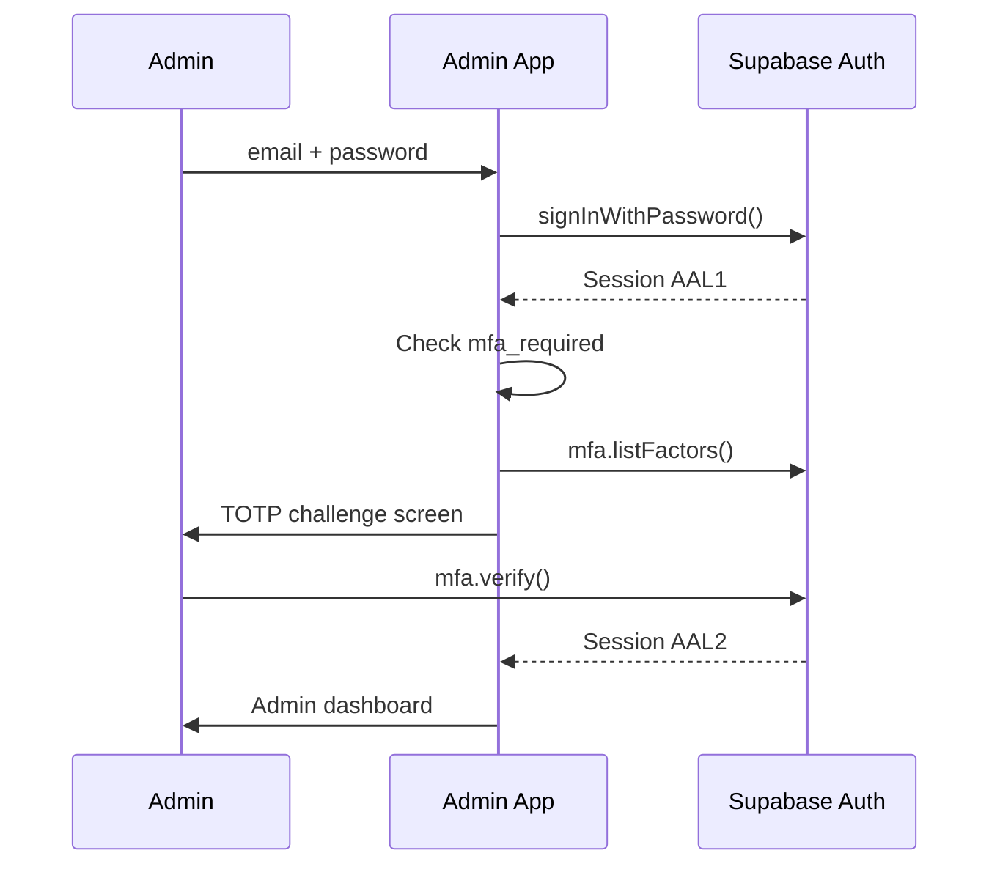
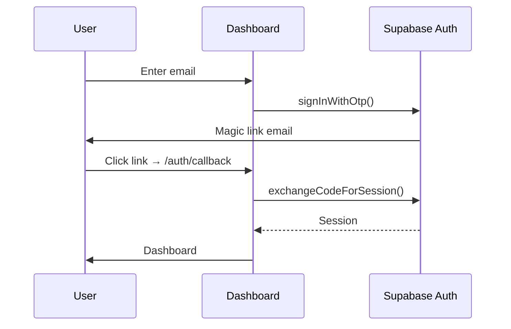

# Nertura — Authentication Architecture

> Production authentication design for email/password, magic link, MFA, sessions, and organization onboarding. Implementation-ready for Phase 4 — no UI in this phase.

**Status:** Phase 3 · **Owner:** Engineering / CSO  
**Companion:** [`supabase-setup-guide.md`](supabase-setup-guide.md), [`database-security-rules.md`](database-security-rules.md), [`security-master-plan.md`](security-master-plan.md)

---

## Design principles

1. **Supabase Auth is the identity provider** — passwords and MFA factors never stored in `public.users`
2. **`public.users` is the application profile** — synced from `auth.users` via database trigger
3. **`memberships` is the authorization source** — org role for RLS; not JWT claims alone
4. **Server validates every protected request** — `@supabase/ssr` + Route Handler session check
5. **Service role is server-only** — onboarding RPC, Stripe webhooks, audit writes
6. **Fail closed** — unauthenticated, unconfirmed, or MFA-incomplete users blocked at edge

---

## System overview

```
┌─────────────────────────────────────────────────────────────────────────┐
│                         Client (Browser / PWA)                          │
│  marketing.nertura.com  │  app.nertura.com  │  admin.nertura.com        │
└────────────┬────────────────────┬──────────────────────┬────────────────┘
             │                    │                      │
             │  public pages      │  auth pages          │  admin auth + MFA gate
             ▼                    ▼                      ▼
┌─────────────────────────────────────────────────────────────────────────┐
│                    Next.js 15 App (Vercel)                              │
│  @supabase/ssr — cookie session                                         │
│  Route Handlers: /auth/callback, /auth/confirm, /api/auth/*               │
└────────────┬────────────────────────────────────────────────────────────┘
             │
             ▼
┌─────────────────────────────────────────────────────────────────────────┐
│                      Supabase Auth (GoTrue)                             │
│  auth.users │ auth.sessions │ auth.mfa_factors │ auth.identities        │
└────────────┬────────────────────────────────────────────────────────────┘
             │ JWT (access + refresh)
             ▼
┌─────────────────────────────────────────────────────────────────────────┐
│                    Supabase Postgres + RLS                              │
│  public.users │ memberships │ organizations │ audit_logs              │
└─────────────────────────────────────────────────────────────────────────┘
```

---

## Identity model

### Two-layer user record

| Layer | Table | Responsibility |
|-------|-------|----------------|
| Identity | `auth.users` | Credentials, email verification, MFA, sessions |
| Profile | `public.users` | Name, language, timezone, onboarding state |

Sync trigger: `on_auth_user_created` → `private.handle_new_auth_user()` (migration `20250619000250`).

### Platform admin

Platform admins are identified by JWT claim:

```json
{
  "app_metadata": {
    "role": "platform_admin"
  }
}
```

Checked by `private.is_platform_admin()` for RLS and admin panel access. Set via Supabase Dashboard or Admin API — never client-side.

### Organization access

Users access tenant data through `memberships`:

```
auth.users.id  →  public.users.id  →  memberships  →  organizations
```

RLS functions (`private.is_org_member`, `private.can_write_org`, etc.) query `memberships` — not JWT org claims. JWT org claims are optional for UX (active org switcher) but **not authoritative**.

---

## Auth methods

### 1. Email / password

| Step | Actor | Action |
|------|-------|--------|
| Register | Client | `supabase.auth.signUp({ email, password, options: { emailRedirectTo } })` |
| Confirm | Email link | Redirect to `/auth/callback?code=...` |
| Login | Client | `supabase.auth.signInWithPassword({ email, password })` |
| Profile sync | DB trigger | `public.users` row created/updated |

**Password policy (Supabase Dashboard):**
- Minimum 12 characters
- Leaked password protection enabled
- No max length cap below 128

**Post-login (Phase 4 Route Handler):**
- Update `public.users.last_login_at`
- Call `public.log_auth_event('login.success', ...)`

### 2. Magic link (OTP email)

Uses the same Email provider — no separate configuration.

| Step | API |
|------|-----|
| Request link | `supabase.auth.signInWithOtp({ email, options: { emailRedirectTo, shouldCreateUser } })` |
| Verify | User clicks link → `/auth/callback` exchanges code for session |
| OTP code | User enters 6-digit code → `supabase.auth.verifyOtp({ email, token, type: 'email' })` |

**When to use:**
- Passwordless login on dashboard (mobile-friendly)
- Admin passwordless is **disabled** — admin requires password + MFA

**Config:** `supabase/config.toml` → `[auth.email]` → `otp_length = 6`, `otp_expiry = 3600`

### 3. MFA (TOTP) — ready, enforced per role

MFA is managed entirely by Supabase Auth (`auth.mfa_factors`).

| Surface | MFA policy |
|---------|------------|
| **Admin** (`admin.nertura.com`) | **Mandatory** before any module access |
| **Dashboard** (`app.nertura.com`) | Optional at launch; `users.mfa_required` flag for per-user enforcement |
| **Marketing** | No MFA |

**Enrollment flow (Phase 4):**

```
1. signInWithPassword → session AAL1
2. mfa.enroll({ factorType: 'totp' }) → QR code
3. mfa.challenge() + mfa.verify() → session AAL2
4. Set users.mfa_required = true (admin users, via service role)
```

**Session assurance levels:**

| AAL | Meaning | Required for |
|-----|---------|--------------|
| AAL1 | Password or magic link only | Marketing, optional dashboard |
| AAL2 | MFA verified | Admin panel, sensitive dashboard actions (V2) |

Check in Route Handler:

```typescript
const { data: aal } = await supabase.auth.mfa.getAuthenticatorAssuranceLevel();
if (aal.currentLevel !== 'aal2') { /* redirect to /auth/mfa */ }
```

---

## Session management

### Cookie-based SSR (`@supabase/ssr`)

All three Next.js apps use the same pattern (Phase 4 implementation):

| Cookie | Purpose |
|--------|---------|
| `sb-<ref>-auth-token` | Access + refresh token chunk(s) |
| HttpOnly | ✅ Prevents XSS token theft |
| Secure | ✅ Production only |
| SameSite | `Lax` |

### Token lifecycle

| Token | Expiry | Rotation |
|-------|--------|----------|
| Access JWT | 3600s (1 hour) | Refreshed automatically |
| Refresh token | 7 days default | Rotated on use (Supabase default) |

Configured in `supabase/config.toml`: `jwt_expiry = 3600`

### Session policies

| Policy | App | Admin |
|--------|-----|-------|
| Idle timeout | 8 hours | 30 minutes |
| Max concurrent sessions | 5 | 3 |
| Revoke all sessions | User settings (Phase 4) | Admin user management |

Implementation: `supabase.auth.signOut({ scope: 'global' })` + audit log.

### Protected route pattern (Phase 4)

```
Request → middleware.ts
  → createServerClient (@supabase/ssr)
  → getUser() — validates JWT server-side
  → if !user → redirect /login
  → if admin && AAL < 2 → redirect /auth/mfa
  → continue
```

**Never use `getSession()` alone for authorization** — always `getUser()`.

---

## Organization onboarding

### New user journey

```
Signup (auth.users)
    │
    ▼
Email confirmed
    │
    ▼
Login → dashboard
    │
    ▼
Onboarding wizard (Phase 4 UI)
    │
    ▼
create_organization_with_owner() RPC
    │
    ├── organizations (trial)
    ├── memberships (owner)
    ├── subscriptions (starter, trialing, 14-day trial)
    └── users.onboarding_completed_at = now()
    │
    ▼
Dashboard home
```

### Atomic onboarding RPC

Function: `public.create_organization_with_owner()` (migration `20250620000000`)

Called from authenticated client:

```typescript
const { data: orgId, error } = await supabase.rpc('create_organization_with_owner', {
  p_name: 'My Farm',
  p_slug: 'my-farm',
  p_type: 'farm',
  p_country_code: 'TR',
});
```

Security:
- `SECURITY DEFINER` with `search_path = public`
- Requires `auth.uid()` — cannot be called anonymously
- Creates owner membership — satisfies RLS for all subsequent queries
- Emits audit event `onboarding.organization_created`

### Returning user (multi-org, V2)

Future: org switcher stores `active_organization_id` in session/cookie; Route Handlers set `SET LOCAL app.current_org_id` when using service role with user context.

---

## Auth flows reference

### Signup + confirm



### Login + MFA (admin)



### Magic link



---

## Audit and security events

All auth events write to `audit_logs` via `public.log_auth_event()`:

| Event | Category | Severity |
|-------|----------|----------|
| `login.success` | auth | info |
| `login.failed` | auth | warning |
| `logout` | auth | info |
| `mfa.enrolled` | auth | info |
| `mfa.challenge_failed` | security | warning |
| `password.reset_requested` | auth | info |
| `onboarding.organization_created` | auth | info |

---

## App-specific auth scope

| App | Auth required | Methods | MFA |
|-----|---------------|---------|-----|
| Marketing | No (public) | — | — |
| Dashboard | Yes | Email/password, magic link | Optional |
| Admin | Yes | Email/password only | **Mandatory** |

Marketing site has **no Supabase client access to tenant tables** (database-security-rules Pattern D).

---

## Phase 4 implementation checklist

When building auth UI (next phase):

- [ ] Install `@supabase/ssr` + `@supabase/supabase-js` in dashboard and admin
- [ ] Add `middleware.ts` session refresh
- [ ] Add `/auth/callback` Route Handler (PKCE code exchange)
- [ ] Add `/login`, `/register`, `/auth/mfa` pages (dashboard)
- [ ] Add admin login + MFA gate
- [ ] Add onboarding wizard calling `create_organization_with_owner`
- [ ] Wire `log_auth_event` on login/logout
- [ ] E2E tests: signup, login, magic link, MFA, onboarding

---

## Related database objects

| Object | Location |
|--------|----------|
| User profile | `public.users` |
| Org membership | `public.memberships` |
| Onboarding RPC | `public.create_organization_with_owner()` |
| Auth audit | `public.log_auth_event()` |
| RLS helpers | `private.is_org_member()`, etc. |
| Auth sync trigger | `on_auth_user_created` on `auth.users` |

---

*Auth Architecture v1.0 — Phase 3*
