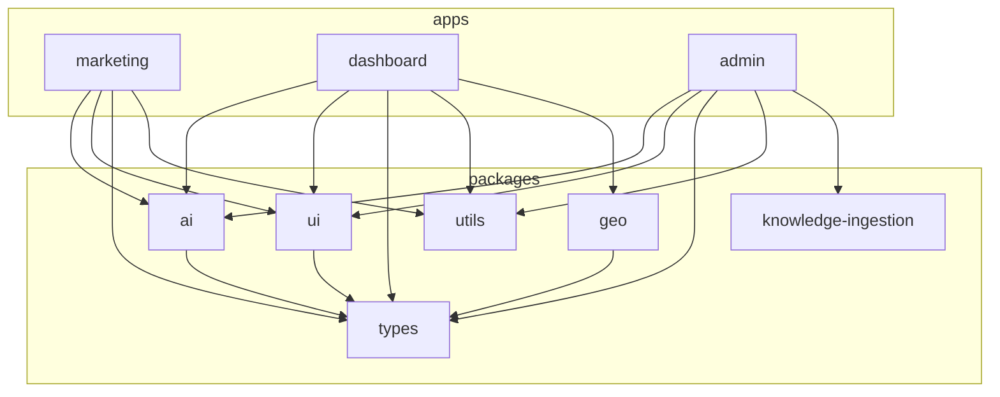

# Chapter 01 — Monorepo Architecture

## Purpose

Define the **single repository layout** for Nertura so every engineer and AI agent knows where code lives, how packages depend on each other, and how local development maps to production domains.

---

## Principles

1. **One repo, three apps, shared packages** — no duplicate business logic across marketing, dashboard, and admin
2. **pnpm workspaces** — deterministic installs; `workspace:*` for internal deps
3. **Turborepo orchestration** — `dev`, `build`, `lint`, `typecheck` run with correct dependency order
4. **Package boundaries are contracts** — apps consume packages; packages never import from apps
5. **Ports are fixed** — 3000 / 3001 / 3002; do not change without updating all env configs

---

## Architecture

```
Nertura/
├── apps/
│   ├── marketing/     @nertura/marketing   :3000   nertura.com
│   ├── dashboard/     @nertura/dashboard   :3001   app.nertura.com
│   └── admin/         @nertura/admin       :3002   admin.nertura.com
├── packages/
│   ├── ai/            @nertura/ai           Intelligence engine (server-only)
│   ├── ui/            @nertura/ui           Shared React + Tailwind design system
│   ├── types/         @nertura/types        Domain + DB TypeScript types
│   ├── utils/         @nertura/utils        slugify, URLs, image helpers
│   ├── geo/           @nertura/geo          Map providers, geometry, regional APIs
│   ├── knowledge-ingestion/  Admin ingestion pipeline
│   └── typescript-config/    Shared tsconfig bases
├── supabase/
│   ├── migrations/    SQL migrations (schema source of truth)
│   ├── policies/      RLS policy fragments
│   └── seed/          Demo seed data
├── docs/              Strategy + foundation books
└── scripts/           Tooling (test-gemini, CSS checks, etc.)
```

### Toolchain

| Tool | Version | Role |
|------|---------|------|
| **pnpm** | 9.x (`packageManager: pnpm@9.15.0`) | Workspace package manager |
| **Turborepo** | 2.x | Task pipeline with `dependsOn: ["^build"]` for builds |
| **Next.js** | 15.x | App Router on all three apps |
| **React** | 19.x | UI runtime |
| **TypeScript** | 5.7.x | End-to-end type safety |
| **Supabase CLI** | via `npx supabase` | Local DB, migrations, RLS verify |

### Workspace configuration

`pnpm-workspace.yaml`:

```yaml
packages:
  - "apps/*"
  - "packages/*"
```

Root `package.json` scripts delegate to Turbo:

| Script | Effect |
|--------|--------|
| `pnpm dev` | `turbo run dev` — all apps in parallel |
| `pnpm build` | `turbo run build` — packages first, then apps |
| `pnpm lint` | `turbo run lint` |
| `pnpm typecheck` | `turbo run typecheck` |
| `pnpm supabase:push` | Apply migrations to linked Supabase project |
| `pnpm supabase:verify:rls` | Execute `supabase/scripts/verify-rls.sql` |

### The three apps

| Package | Port | Domain | Auth | Primary role |
|---------|------|--------|------|--------------|
| `@nertura/marketing` | 3000 | nertura.com | None (guest) | Homepage, guest AI Doctor, legal/SEO |
| `@nertura/dashboard` | 3001 | app.nertura.com | Supabase SSR + middleware | Farmer OS — fields, doctor, credits |
| `@nertura/admin` | 3002 | admin.nertura.com | Supabase + `platform_admin` | Platform control, outreach, KB |

### Shared packages

| Package | Consumed by | Server-only? |
|---------|-------------|--------------|
| `@nertura/ai` | All apps (API routes only) | **Yes** — Gemini keys, intelligence engine |
| `@nertura/ui` | All apps | No — React components |
| `@nertura/types` | All packages + apps | N/A — types only |
| `@nertura/utils` | Apps + packages | Mostly universal |
| `@nertura/geo` | Dashboard (+ UI map) | Providers may use server env |
| `@nertura/knowledge-ingestion` | Admin | Yes — ingestion scripts |
| `@nertura/typescript-config` | Dev dependency | N/A |

### Dependency graph (simplified)



---

## Decision Rationale

**Monorepo over polyrepo** — Nertura's AI pipeline, design system, and database types change together. A single repo lets one PR update migration + types + API + UI atomically.

**pnpm over npm/yarn** — Strict `node_modules` layout prevents phantom dependencies; `workspace:*` pins internal packages without publish cycles.

**Turborepo over raw scripts** — Caching and `^build` ordering mean package changes rebuild dependents automatically; `dev` is marked `persistent: true` and uncached.

**Three apps, one database** — Marketing (guest), dashboard (tenant), and admin (platform) share one Supabase project per environment with RLS tenant isolation — not three databases.

**Legacy naming retired** — Older docs reference `apps/web`, `apps/app`, `@nertura/db`, `@nertura/brain-client`. Implemented names are `marketing`, `dashboard`, `@nertura/types`, `@nertura/ai`.

---

## Examples

### Run a single app

```bash
pnpm --filter @nertura/dashboard dev
pnpm --filter @nertura/marketing dev:fresh
```

### Add a workspace dependency

In `apps/dashboard/package.json`:

```json
"@nertura/geo": "workspace:*"
```

Then `pnpm install` from repo root.

### Filtered build for deploy

```bash
pnpm --filter @nertura/dashboard build
```

Vercel projects use per-app root directories: `apps/marketing`, `apps/dashboard`, `apps/admin`.

---

## Best Practices

- Run `pnpm install` only from **repository root**
- Use `workspace:*` for all `@nertura/*` dependencies — never hardcode versions
- Put shared logic in `packages/`, not duplicated in two apps
- Keep API keys and AI calls in route handlers or server modules — see [Chapter 04](04-react-and-nextjs.md)
- After schema changes, update `@nertura/types` and run `pnpm typecheck` before PR

---

## Bad Practices

- Creating a fourth app without executive approval and foundation update
- Importing `@nertura/dashboard` code from `@nertura/marketing` (apps do not depend on each other)
- Publishing `@nertura/*` to npm — these are private workspace packages
- Running `npm install` or `yarn` inside the monorepo
- Changing Turbo `outputs` without updating Vercel cache config

---

## Future Considerations

- **Turborepo remote cache** for CI speed when team grows
- **`packages/config-eslint`** — shared ESLint flat config (partially at root today)
- **E2E package** — Playwright in `apps/e2e` or `packages/e2e` when regression suite matures
- **Storybook** in `packages/ui` for design system documentation (Book 02 alignment)

---

## Cross-References

- [Chapter 02 — Folder Structure](02-folder-structure-and-naming.md)
- [Chapter 11 — Migration Policy](11-migration-policy.md)
- [Book 01 — Product Bible § Core Philosophy](../01-product-bible/02-core-philosophy.md)
- [`docs/NERTURA_ARCHITECTURE_BIBLE.md`](../../NERTURA_ARCHITECTURE_BIBLE.md) § Monorepo Map
