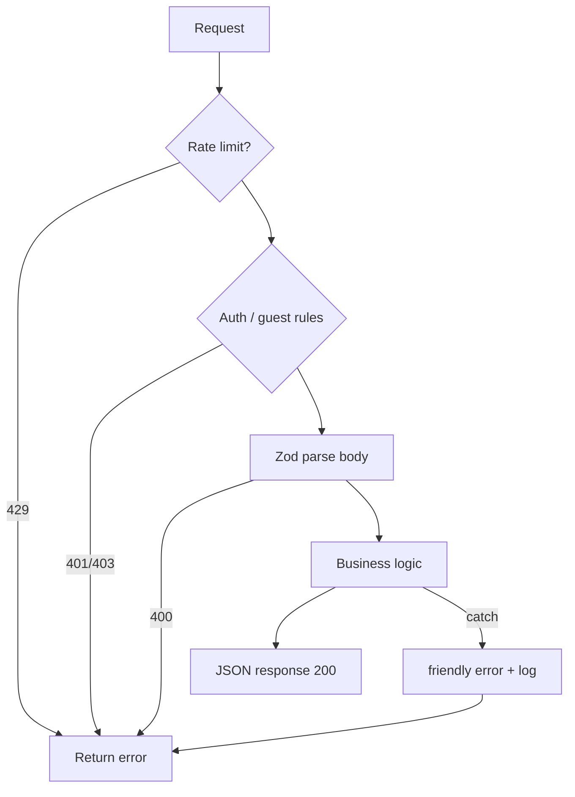

# Chapter 06 — API Conventions

## Purpose

Standardize **Next.js Route Handlers** — request validation, auth context, error shapes, and status codes — so marketing, dashboard, and admin APIs behave predictably for clients and future mobile apps.

---

## Principles

1. **Zod at the door** — parse `request.json()` before business logic
2. **Auth first** — `getDashboardContext()` or explicit public/guest path before DB writes
3. **Consistent error field** — `{ error: string }` minimum; extend with `code`, `retryable`, `limitReached`
4. **HTTP status codes mean something** — 400 validation, 401 auth, 402 credits, 429 rate limit, 503 provider
5. **Idempotent webhooks** — Stripe and cron handlers safe on retry

---

## Architecture

### Route handler layout

```
apps/<app>/src/app/api/
├── ai/
│   ├── doctor/route.ts       # POST — authenticated diagnosis
│   └── chat/route.ts         # POST — ops assistant
├── fields/
│   ├── route.ts              # GET/POST
│   └── [id]/boundary/route.ts
├── onboarding/complete/route.ts
├── webhooks/stripe/route.ts
└── ...
```

Export named HTTP functions only: `GET`, `POST`, `PATCH`, `DELETE`.

### Standard handler flow



### Validation (Zod)

```typescript
const bodySchema = z.object({
  conversationId: z.string().uuid().optional(),
  message: z.string().min(1).max(4000),
});

// In handler:
const body = bodySchema.parse(await request.json());
```

For complex forms, use `.refine()` for cross-field rules (message OR image required).

**ZodError handling:**

```typescript
import { ZodError } from 'zod';

if (err instanceof ZodError) {
  return NextResponse.json(
    { error: 'Invalid request', details: err.flatten() },
    { status: 400 }
  );
}
```

### Auth context (dashboard)

`getDashboardContext()` from `@/lib/auth/context` returns `userId`, `organizationId`, `organizationName`, membership role — use for all tenant-scoped queries.

Marketing guest doctor: separate limit check against `guest_usage` / `GUEST_QUESTION_LIMIT` from `@nertura/ai`.

Admin routes: verify session + `isPlatformAdmin()` before mutations.

### Error response shapes

| Scenario | Status | Body |
|----------|--------|------|
| Validation | 400 | `{ error: string, details?: ... }` |
| Unauthorized | 401 | `{ error: 'Unauthorized' }` |
| Credits exhausted | 402 | `{ error, limitReached: true, usage }` |
| Rate limited | 429 | `{ error }` + `Retry-After` header |
| Provider busy | 503 | `{ error, retryable: true }` |
| Success (doctor) | 200 | `{ conversationId, diagnosis, message, usage, ... }` |

Shared types in `@nertura/types`:

```typescript
interface ApiError {
  code: string;
  message: string;
  details?: Record<string, unknown>;
}
```

New CRUD endpoints should move toward `{ data, error }` (`ApiResponse<T>`) for consistency.

### Rate limiting

`checkRateLimit(key)` from `@/lib/ai/rate-limit` — in-memory sliding window (60s, 20 req). Key by IP or `userId`:

```typescript
const ip = request.headers.get('x-forwarded-for')?.split(',')[0]?.trim() ?? 'unknown';
const rate = checkRateLimit(`doctor:${ip}`);
if (!rate.ok) {
  return NextResponse.json(
    { error: 'Too many requests. Please wait and try again.' },
    { status: 429, headers: rate.retryAfter ? { 'Retry-After': String(rate.retryAfter) } : {} }
  );
}
```

### Webhooks & cron

| Endpoint | Auth |
|----------|------|
| `POST /api/webhooks/stripe` | Stripe signature |
| `GET /api/cron/outreach-weekly` | `Authorization: Bearer $CRON_SECRET` |

Never expose cron URLs without secret verification.

### File uploads

Doctor image flow: base64 in JSON body → `validateImageInput` → storage upload server-side. Max 5 MB; JPG/PNG/WebP only — not multipart in v1 doctor API.

---

## Decision Rationale

**Route Handlers over external API framework** — colocated with Next app, one deploy unit on Vercel, shared auth cookies.

**Zod** — runtime validation matches TypeScript at boundary; single dependency already in all apps.

**402 for credits** — distinguishes payment/limit from 403 forbidden; client shows upgrade CTA.

---

## Examples

### Good — doctor route error mapping

```typescript
} catch (err) {
  if (err instanceof Error && err.message.includes('Gemini')) {
    return NextResponse.json(
      { error: 'Gemini is experiencing high demand. Please try again in a moment.', retryable: true },
      { status: 503 }
    );
  }
  const message = err instanceof Error ? err.message : 'Doctor request failed';
  console.error('[doctor] request failed', err);
  return NextResponse.json(
    { error: friendlyDoctorError(message, 'tr'), retryable: true },
    { status: 400 }
  );
}
```

### Good — credit gate before AI

```typescript
const usage = await getUserUsage(supabase, ctx.userId, ctx.organizationId);
if (usage.limitReached) {
  return NextResponse.json(
    { error: 'No questions or credits remaining. Upgrade to continue.', limitReached: true, usage },
    { status: 402 }
  );
}
```

---

## Best Practices

- Prefix server logs with route tag: `[doctor]`, `[stripe-webhook]`
- Return farmer-friendly `error` strings — use `friendlyDoctorError` for AI routes
- Debit credits only after successful pipeline completion
- Use `crypto.randomUUID()` for client-visible message ids when not returned from DB
- Document new routes in Architecture Bible entry points when shipping major features

---

## Bad Practices

- Returning stack traces or `err.message` from Gemini/raw providers to clients
- Skipping auth on `/api/*` because "it's internal"
- 200 OK with `{ error: ... }` body — use correct status codes
- Parsing `request.json()` twice
- Service role client in dashboard farmer APIs to "skip RLS"

---

## Future Considerations

- **OpenAPI spec** generated from Zod schemas for partner API
- **Redis rate limiting** when in-memory limit is insufficient across Vercel instances
- **API versioning** `/api/v1/` if mobile clients need stability guarantees
- **tRPC** — not adopted; revisit only if type-safe RPC pain exceeds route handler benefit

---

## Cross-References

- [Chapter 03 — TypeScript Standards](03-typescript-standards.md)
- [Chapter 08 — Error Handling & Logging](08-error-handling-and-logging.md)
- [Chapter 07 — Security Standards](07-security-standards.md)
