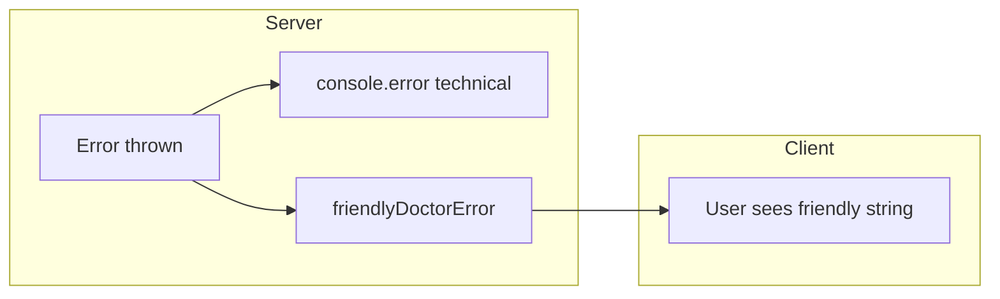

# Chapter 08 — Error Handling & Logging

## Purpose

Separate **farmer-friendly user messages** from **technical server logs** — so failures are debuggable by engineers without exposing Gemini stack traces, SQL errors, or API keys to farmers or guests.

---

## Principles

1. **Users see calm, actionable copy** — TR + EN for AI/upload errors
2. **Engineers see full context server-side** — `console.error` with route tag + error object
3. **Never leak providers** — no "Gemini API key invalid" in JSON responses
4. **Preserve business errors** — credit/limit messages pass through unchanged
5. **Retry hints when appropriate** — `retryable: true` for 503 / transient AI

---

## Architecture

### Two-channel model



| Channel | Audience | Content |
|---------|----------|---------|
| HTTP `error` field | End user | Localized, non-technical |
| Server logs | Engineers | Stack, provider response, ids |
| Admin AI logs | Operators | Structured pipeline metadata (admin app) |

### `friendlyDoctorError` (canonical "friendly AI error")

Implemented in `packages/ai/src/upload-messages.ts` and exported from `@nertura/ai`. This is the **standard mapper** for AI route failures (referred to as friendly AI error pattern in specs).

```typescript
export function friendlyDoctorError(
  raw: string | undefined,
  language: ConversationLanguage = 'tr'
): string
```

**Behavior:**

| Raw signal | User message |
|------------|--------------|
| Empty | Generic "Something went wrong" / TR equivalent |
| `limit`, `credit`, `account` | Pass through raw (business message) |
| `429`, `too many` | "AI is busy" — wait and retry |
| `503`, `unavailable` | Service unreachable — retry shortly |
| Image MIME / size errors | `userFacingUploadError` codes |
| `gemini`, `api key`, `configured` | "AI guidance temporarily limited" |
| Default | Generic retry message |

Related: `userFacingUploadError(code, language)` for structured upload validation codes (`missing`, `unsupported`, `too_large`, etc.).

### Upload errors (bilingual)

```typescript
const UPLOAD_ERRORS: Record<ImageValidationErrorCode, { tr: string; en: string }> = {
  too_large: {
    tr: 'Fotoğraf çok büyük. Lütfen 5 MB altında bir görüntü yükleyin.',
    en: 'This photo is too large. Please use an image under 5 MB.',
  },
  // ...
};
```

### Route handler pattern (doctor)

```typescript
} catch (err) {
  if (err instanceof Error && err.message.includes('Gemini')) {
    return NextResponse.json(
      { error: 'Gemini is experiencing high demand. Please try again in a moment.', retryable: true },
      { status: 503 }
    );
  }
  const message = err instanceof Error ? err.message : 'Doctor request failed';
  console.error('[doctor] request failed', err);
  return NextResponse.json(
    { error: friendlyDoctorError(message, 'tr'), retryable: true },
    { status: 400 }
  );
}
```

**Note:** The 503 branch still uses a semi-technical English string in one path — client may run `friendlyDoctorError` on display; prefer mapping all paths through `friendlyDoctorError` for consistency.

### Client display

Client components (`chat-app.tsx`, `home-doctor-form.tsx`) should:

- Show `response.error` in Alert UI
- Handle `limitReached` with signup / credits CTA
- Not `console.log` full response bodies in production

### Logging conventions

| Practice | Example |
|----------|---------|
| Route prefix | `[doctor]`, `[stripe-webhook]`, `[onboarding]` |
| Include error object | `console.error('[doctor] request failed', err)` |
| No PII dumps | Do not log full message content at info level in production |
| Correlation | Include `conversationId` / `userId` when logging failures post-auth |

### Provider errors

`GeminiError` and similar in `@nertura/ai` — catch in service layer, log details, throw or return sanitized message for route layer.

---

## Decision Rationale

**Centralized copy in `@nertura/ai`** — marketing and dashboard share the same farmer-facing strings; translators update one file.

**Pass-through for credits** — "No credits remaining" is already user-appropriate; remapping would harm clarity.

**Server-only logging** — browser consoles on shared farm devices must not receive stack traces.

---

## Examples

### Good — validation before AI call

```typescript
const validation = validateImageInput(imageBase64, imageMimeType);
if (!validation.ok) {
  return NextResponse.json(
    { error: userFacingUploadError(validation.code, conversationLanguage) },
    { status: 400 }
  );
}
```

### Good — Zod failure

```typescript
return NextResponse.json({ error: 'Invalid request', details: err.flatten() }, { status: 400 });
```

### Bad — raw provider error to client

```typescript
return NextResponse.json({ error: err.message }, { status: 500 });
// might expose: "API key not valid. Please pass a valid API key."
```

---

## Best Practices

- Always call `friendlyDoctorError` (or upload helper) before returning AI errors to clients
- Log once at the boundary (route handler), not at every nested function
- Use conversation language from `resolveLockedConversationLanguage` when mapping errors
- Return `retryable: true` when UI should show Retry button
- Record failures in `ai_provider_outputs` / admin logs for operator debugging

---

## Bad Practices

- Alerting farmers with HTTP status codes ("Error 500")
- Logging base64 image data
- Exposing Supabase `error.message` with table/column names to client
- Swallowing errors silently (`catch {}`) without comment — only optional field-case updates may skip quietly with comment
- German/French error strings until i18n framework lands — TR + EN only today

---

## Future Considerations

- **Structured logging** — JSON logs to Datadog/Axiom with `requestId`
- **Sentry** — client + server with PII scrubbing
- **Error code enum** — `DOCTOR_RATE_LIMIT`, `CREDITS_EXHAUSTED` for client branching without string match
- **Rename alias** — document `friendlyDoctorError` as `friendlyAiError` export if naming consistency desired

---

## Cross-References

- [Chapter 06 — API Conventions](06-api-conventions.md)
- [Book 04 — AI Behaviour Manual](../04-ai-behaviour/) — tone and safety
- `packages/ai/src/upload-messages.ts`
