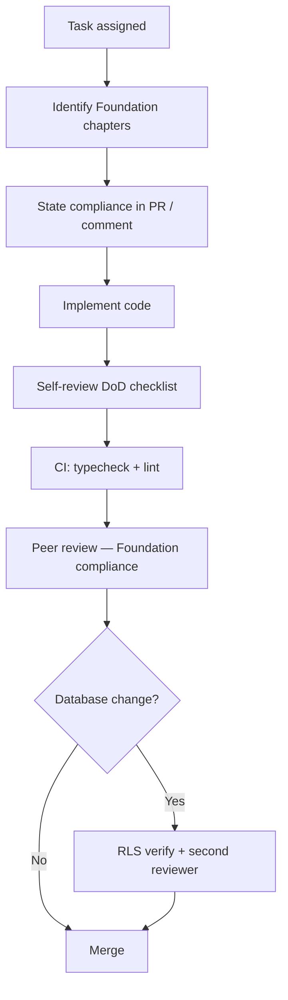

# Chapter 12 — Code Review & Definition of Done

## Purpose

Provide a **Definition of Done (DoD)** checklist and code review standards so every merged PR ships work that is secure, typed, documented in foundation when needed, and aligned with [Book 01](../01-product-bible/12-feature-gate-criteria.md) product law.

---

## Principles

1. **Foundation first** — identify chapter, state compliance, then code ([Constitution](../CONSTITUTION.md) Article III)
2. **No merge without quality gates** — typecheck and lint pass
3. **Security is not optional review** — RLS, secrets, auth on every touching PR
4. **Product gate for features** — "Does this solve the farmer's problem faster?"
5. **Small PRs win** — one migration, one feature, one bugfix when possible
6. **Foundation updates for law changes** — amend Foundation before code that contradicts it

---

## Architecture

### Code review flow



### Reviewer focus areas

| Area | Questions |
|------|-----------|
| **Foundation** | Which chapters apply? Does PR state compliance? Any contradiction with Foundation? |
| **Product** | Does this match Book 01 depth ladder and neutral advisor rule? |
| **Security** | RLS? Auth? Secrets? Rate limits? Service role scoped? |
| **AI** | Uses `runIntelligenceEngine`? No client `@nertura/ai`? |
| **Types** | `@nertura/types` updated? Zod on API body? |
| **UX** | Book 02 tokens? Mobile? Empty states? |
| **Ops** | Migration pushed before deploy? `dev:fresh` noted if build tested? |

### Definition of Done — universal checklist

Copy into PR description for non-trivial work:

#### Foundation compliance (required)

- [ ] Relevant Foundation chapter(s) identified and linked
- [ ] Compliance explained (how change satisfies Foundation — not merely "read docs")
- [ ] Gate question answered if feature work ([Book 01 Ch. 12](../../01-product-bible/12-feature-gate-criteria.md))
- [ ] No contradiction with Foundation; if code was wrong, code fixed — not Foundation ignored
- [ ] If Foundation law changed, chapter updated **before** merge ([Constitution](../../CONSTITUTION.md) Article IV)

#### Code quality

- [ ] `pnpm typecheck` passes
- [ ] `pnpm lint` passes
- [ ] `pnpm format:check` passes (or formatted)
- [ ] No new `any`, `@ts-ignore`, or unexplained `eslint-disable`
- [ ] Changes scoped to task — no drive-by refactors

#### Security & data

- [ ] No secrets in client code or `NEXT_PUBLIC_*`
- [ ] Tenant queries scoped by `organization_id` from auth context
- [ ] New tables have RLS + migration file
- [ ] `pnpm supabase:verify:rls` run if migrations/policies changed
- [ ] Upload paths validated (type, size) if applicable
- [ ] Admin-only paths check `platform_admin`

#### API & errors

- [ ] Request bodies validated with Zod
- [ ] Correct HTTP status codes
- [ ] User-facing errors use `friendlyDoctorError` / `userFacingUploadError` for AI routes
- [ ] Server logs use route prefix; no PII leakage

#### AI (if touching doctor)

- [ ] Pipeline goes through `runIntelligenceEngine` / doctor service — not raw provider from UI
- [ ] Credits debited correctly; guest limits respected on marketing
- [ ] Knowledge Bank items remain `review_pending` until human approval
- [ ] No auto-send outreach or auto-publish content

#### UI (if touching frontend)

- [ ] `'use client'` only where needed
- [ ] `@nertura/ui` components and tokens used
- [ ] Loading and error states handled
- [ ] Map uses dynamic import if added

#### Database (if touching schema)

- [ ] Migration file in `supabase/migrations/`
- [ ] `packages/types` updated
- [ ] RPC documented in PR if new
- [ ] Seed updated if verify scripts depend on fixtures

#### Deploy readiness

- [ ] Env vars documented in `.env.example` if new
- [ ] `pnpm build` succeeds for affected app(s)
- [ ] After local build, author used `dev:fresh` if continuing dev
- [ ] Migration apply order noted for release (`supabase:push` before Vercel)

#### Documentation

- [ ] Foundation book updated if engineering law changed
- [ ] Architecture Bible entry point updated for major new routes (optional but encouraged)

---

### PR size guidance

| Size | Files | Review time |
|------|-------|-------------|
| XS | 1–3 | < 15 min |
| S | 4–10 | < 30 min |
| M | 11–20 | Same day |
| L | 20+ | Split if possible |

Database + types + API + UI for one feature is acceptable if one vertical slice.

### Roles

| Role | Responsibility |
|------|----------------|
| Author | Self-check DoD, write test plan in PR |
| Reviewer | Block on security/type/migration gaps |
| CTO / tech lead | Approve RLS policy changes, new packages, auth model changes |

### What blocks merge

- Failing typecheck or lint
- Missing migration for schema change
- Client import of `@nertura/ai`
- Exposed service role or provider API key
- `ADMIN_AUTH_DISABLED` in production config
- Auto-send email or content without approval gate
- Contradicts Book 01 without executive note in PR

### What does not require CTO review

- Copy changes, bug fixes within patterns
- New dashboard field card using existing loaders
- Styling within Book 02 tokens

---

## Decision Rationale

**Checklist over memory** — RC-2 velocity depends on contractors and AI agents shipping safely without oral tradition.

**RLS second reviewer** — one missed policy exposes all orgs' field data.

**Product gate in engineering DoD** — prevents clever tech that farmers did not ask for ([Book 01 Feature Gate](../01-product-bible/12-feature-gate-criteria.md)).

---

## Examples

### Good PR description

```markdown
## Summary
Adds field case link when doctor run includes `caseId`.

## Test plan
- [ ] Open field case → ask doctor → case status updates to monitoring
- [ ] pnpm typecheck && pnpm lint
- [ ] No migration

## DoD
Security: uses existing auth context; no new tables.
AI: existing doctor route; case update optional on failure.
```

### Good review comment

> Block: this route uses `createServiceClient()` but runs for all authenticated users — use user-scoped server client so RLS applies.

---

## Best Practices

- Review your own diff first — catch debug `console.log` and `.only`
- Link foundation chapter when implementing new pattern
- Split generated types from hand-written if noisy diff
- Praise good error handling and thin server pages in review

---

## Bad Practices

- "LGTM" on migrations without running verify
- Merging Friday deploy without migration push plan
- Skipping DoD because "it's small"
- Review bikeshedding naming while missing RLS hole
- Adding features that fail Book 01 feature gate

---

## Future Considerations

- **Required CI checks** on `main` — GitHub branch protection
- **ADR template** in `docs/foundation/03-engineering-standards/adr/` for architectural decisions
- **CODEOWNERS** — `supabase/migrations/` requires security reviewer
- **Automated PR DoD bot** — comment if migration without types change

---

## Cross-References

- [Chapter 09 — Testing & Quality Gates](09-testing-and-quality-gates.md)
- [Chapter 07 — Security Standards](07-security-standards.md)
- [Book 01 — Feature Gate Criteria](../01-product-bible/12-feature-gate-criteria.md)
- [Book 01 — Decision Principles](../01-product-bible/06-decision-principles.md)
- [`docs/foundation/README.md`](../README.md) § Document Quality Standard
