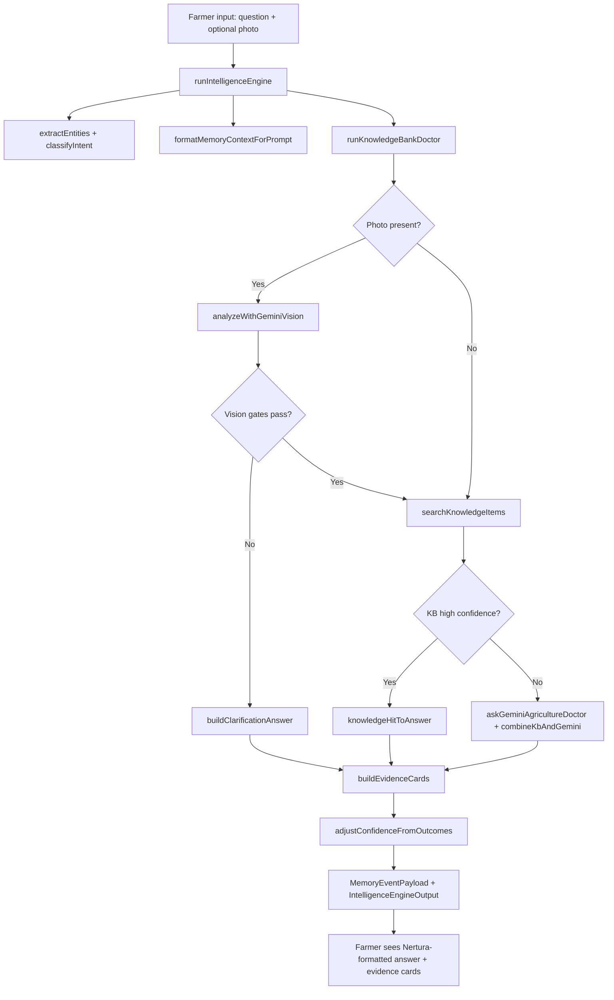

# 01 — AI Architecture Overview

---

## Purpose

Define the canonical intelligence pipeline for every farmer-facing diagnosis. This chapter explains how Nertura transforms a question (and optional photo) into a structured, trustworthy answer — and why **raw Gemini output is never returned to the user**.

---

## Principles

1. **Single orchestrator** — All intelligence flows through `runIntelligenceEngine` in `intelligence-engine.ts`.
2. **Doctor, not chatbot** — Answers are agricultural guidance with diagnosis, risk, and action sections — not free-form LLM prose.
3. **Provider is internal** — Gemini is a research and vision provider; Nertura Brain synthesizes and formats the final answer.
4. **Everything is auditable** — Each run produces reasoning steps, evidence cards, and a `MemoryEventPayload` for persistence.
5. **Fail safe** — When providers fail, fallback answers from the Knowledge Bank or generic safe guidance are used — never empty or raw errors.

---

## Architecture

### High-level flow



### `runIntelligenceEngine` step-by-step

| Step | Function | Output |
|------|----------|--------|
| 1 | `extractEntities(input.question)` | Crops, diseases, pests, symptoms, urgency, language hints |
| 2 | `classifyIntent(question, entities)` | `AgricultureIntent` (diagnosis, pest, fertilizer, …) |
| 3 | `formatMemoryContextForPrompt(context, language)` | Prompt block: conversation, disease history, similar cases, projects |
| 4 | `runKnowledgeBankDoctor(supabase, input)` | `DoctorPipelineOutput`: answer, KB hits, raw provider artifacts |
| 5 | `resolveVisionSummary(pipeline, language)` | Human-readable vision summary for evidence (never `[object Object]`) |
| 6 | `buildEvidenceCards({…})` | Transparent source cards for UI |
| 7 | `adjustConfidenceFromOutcomes(…)` | Optional confidence nudge from historical outcomes |
| 8 | `buildReasoningSteps(…)` | Ordered audit trail (intent → entities → retrieval → provider → synthesis → vision) |
| 9 | Assemble `MemoryEventPayload` | Full snapshot for `ai_memory_events` persistence |

### `runKnowledgeBankDoctor` sub-pipeline

Implemented in `knowledge-bank-doctor.ts`:

1. **Analyze question** — language, crops, diseases, symptoms via `analyzeQuestion`.
2. **Vision first (if photo)** — `analyzeWithGeminiVision` runs *before* KB retrieval.
3. **Vision gates** — low confidence, crop conflict, or vision failure → early return with `buildClarificationAnswer` (no KB bypass).
4. **Knowledge search** — `searchKnowledgeItems` + `pickBestKbHit` with crop-aware slug preference.
5. **Direct KB path** — score ≥ `KB_HIGH_CONFIDENCE_THRESHOLD` (0.78), crop match, vision agreement → `knowledgeHitToAnswer`.
6. **Synthesis path** — Gemini receives KB context + vision block + farm profile + memory block → `combineKbAndGemini`.
7. **Fallback** — Gemini unavailable or error → `buildFallbackAnswer` from top KB hit or safe generic guidance.

### Source attribution

Every answer carries a `source` field on `DoctorAnswer`:

| Source | Meaning |
|--------|---------|
| `knowledge_base` | High-confidence KB hit used directly |
| `brain` | KB + Gemini synthesis (`combineKbAndGemini`) |
| `gemini` | Gemini-only synthesis (no KB hit) |
| `fallback` | Provider failure; KB or safe generic answer |

The farmer never sees `rawGemini` or `rawBrain`. These are stored in `MemoryEventPayload` for internal audit only.

---

## Decision Rationale

### Why never raw Gemini?

Gemini is optimized for helpfulness, not agricultural liability. Unfiltered output can:

- Recommend specific chemical dosages without field context
- Confidently misidentify crops from blurry photos
- Mix languages when KB excerpts are bilingual
- Omit disclaimers and risk levels

Nertura intercepts all provider output through:

- `buildNerturaSections` / `sectionsToDoctorAnswer` — fixed section schema
- `DOCTOR_DISCLAIMER` — appended on every answer via `finalizeAnswer`
- Vision confidence gates — block premature diagnosis
- `buildStrictLanguageBlock` — injected into every Gemini call (via `askGeminiAgricultureDoctor`)

### Why vision before retrieval?

Species must be validated before KB slug matching. A tomato disease article applied to a pepper photo is worse than no answer. See [Chapter 05](05-vision-first-pipeline.md).

### Why a separate intelligence engine layer?

`runKnowledgeBankDoctor` produces a clinical answer. `runIntelligenceEngine` adds product intelligence: intent classification, evidence transparency, outcome-adjusted confidence, and memory event packaging. API routes call the engine, not the doctor directly.

---

## Examples

### Example A — Text-only diagnosis

**Input:** "Domates yapraklarında sarı lekeler var" (TR)

```
extractEntities → crops: [tomato], symptoms: [yellow spots]
classifyIntent → diagnosis
runKnowledgeBankDoctor → KB hit tomato_early_blight (score 0.82)
→ knowledgeHitToAnswer (source: knowledge_base)
buildEvidenceCards → knowledge_bank, farm_memory, weather_regional, …
→ Farmer sees structured TR answer with evidence cards
```

### Example B — Photo with synthesis

**Input:** Photo of wilted leaves + "What's wrong?"

```
analyzeWithGeminiVision → confidence 0.71, cropId: tomato
Vision gates pass (≥ 0.52, no crop conflict)
searchKnowledgeItems → top hit score 0.65 (< 0.78)
askGeminiAgricultureDoctor + combineKbAndGemini
→ source: brain, formatted sections in EN
MemoryEvent stores raw_gemini_output internally, not in UI
```

### Example C — Provider failure

```
askGeminiAgricultureDoctor throws GeminiError
→ buildFallbackAnswer with top KB hit (confidence capped at 0.72)
→ source: fallback, internalNotes explain Gemini unavailable
```

---

## Best Practices

- **Always call `runIntelligenceEngine`** from API routes — never `askGeminiAgricultureDoctor` directly.
- **Pass full `IntelligenceContext`** — conversation history, disease history, similar cases, farm profile, weather, outcome stats.
- **Persist `memoryEvent`** to `ai_memory_events` after every successful run.
- **Surface `evidenceCards`** in the UI so farmers see *why* Nertura answered the way it did.
- **Log `reasoning_steps`** for support and model evaluation — they are designed for human-readable audit.

## Bad Practices

- Returning `pipeline.rawGemini.text` to the client.
- Skipping `finalizeAnswer` and omitting `DOCTOR_DISCLAIMER`.
- Calling Gemini vision after KB retrieval (inverts species validation).
- Bypassing `buildNerturaSections` for "faster" free-text responses.
- Storing only the formatted string without `MemoryEventPayload` (breaks learning loop).

---

## Future Considerations

- **Multi-provider routing** — `DoctorSource` already includes `openai`; engine should remain provider-agnostic.
- **Streaming** — If answers stream, sections must still assemble before display; partial raw tokens must not leak.
- **Edge / offline inference** — Fallback path is the template; local models should produce `NerturaDoctorSections`, not raw text.
- **Guest vs authenticated context** — Memory context blocks differ by RLS; engine accepts context from caller, does not fetch DB directly.

---

## Source References

- `packages/ai/src/intelligence-engine.ts` — `runIntelligenceEngine`, `MemoryEventPayload`, `ReasoningStep`
- `packages/ai/src/knowledge-bank-doctor.ts` — `runKnowledgeBankDoctor`, `KB_HIGH_CONFIDENCE_THRESHOLD`
- `packages/ai/src/answer-formatter.ts` — `buildNerturaSections`, `sectionsToDoctorAnswer`
- `packages/ai/src/types.ts` — `DoctorAnswer`, `DoctorSource`, `DOCTOR_DISCLAIMER`
