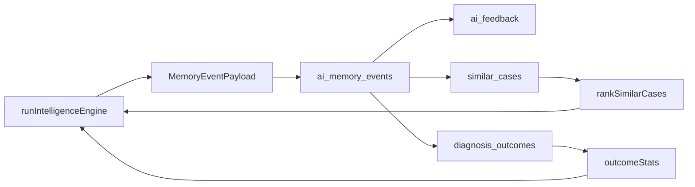

# 10 — Intelligence Evolution

---

## Purpose

Describe how Nertura learns from use: farmer **feedback**, **similar case** ranking, **diagnosis outcomes**, confidence calibration, and the data model that connects today's answer to tomorrow's better answer.

---

## Principles

1. **Every diagnosis is a memory event** — Learning starts with persistent `ai_memory_events`.
2. **Feedback is explicit** — Users opt in via thumbs, outcome buttons, or follow-up surveys — not silent surveillance.
3. **Similar cases help, not dictate** — Ranked past cases inform prompts and evidence; they do not bypass gates.
4. **Outcomes adjust confidence modestly** — Small bounded nudges, not hard overrides.
5. **Closed loop requires quality data** — Wrong feedback labels are worse than no feedback — UI must be clear.

---

## Architecture

### Data model overview



### `ai_memory_events` — learning anchor

Each engine run produces a payload mapped to DB columns (see Chapter 03). Key learning fields:

| Field | Learning use |
|-------|--------------|
| `feedback_status` | Aggregated user sentiment on this event |
| `crop`, `disease`, `pest` | Similar case matching |
| `confidence` | Calibration baseline |
| `retrieval_context` | Replay which KB/evidence was used |
| `final_nertura_answer` | Compare to later outcomes |

**Default:** `feedback_status = 'pending'`

### Feedback types

From `types-intelligence.ts`:

| Type | Meaning |
|------|---------|
| `helpful` | Answer was useful |
| `not_helpful` | Answer missed the mark |
| `problem_solved` | Crop issue resolved |
| `still_sick` | Problem persists |
| `wrong_diagnosis` | Farmer disputes diagnosis |

Stored in:

- `ai_memory_events.feedback_status` — latest status on event
- `ai_feedback` table — individual feedback rows with optional `comment`

API updates status after user action; engine reads aggregated stats on next query.

### Similar cases

**Ranking** — `rankSimilarCases(cases, query, limit)` in `similar-case-ranking.ts`:

Scoring bonuses:

| Signal | Score delta |
|--------|-------------|
| Same crop | +0.35 |
| Same disease | +0.35 |
| Same climate zone | +0.15 |
| Outcome `solved` | +0.25 |
| Outcome `improved` | +0.15 |
| Outcome `worse` | −0.10 |

Returns top N (default 5) as `RankedSimilarCase[]` with `rankReason` audit string.

**Persistence** — `similar_cases` table links `memory_event_id` ↔ `similar_memory_event_id` with `similarity_score` and `match_reason`.

**Usage in engine:**

- Passed via `IntelligenceContext.similarCases`
- Formatted in `formatMemoryContextForPrompt` (top 4)
- Evidence card `similar_cases` when present

### Outcome stats and confidence adjustment

When API loads historical outcomes for crop+disease:

```typescript
if (context.outcomeStats && context.outcomeStats.total > 0) {
  adjustedConfidence = adjustConfidenceFromOutcomes(
    pipeline.answer.confidence,
    context.outcomeStats
  );
}
```

Formula:

```
successRate = (solved + improved * 0.5) / total
failureRate = worse / total
delta = successRate * 0.08 - failureRate * 0.12
result = clamp(base + delta, 0.2, 0.98)
```

**Design intent:** Modest nudge — a streak of successes slightly raises confidence display; repeated failures lower it. Never flips a 0.45 vision clarification to 0.95.

### Follow-up cadence

`FOLLOW_UP_DAYS = [7, 14, 30]` — suggested outcome check-in schedule (product/cron layer).

Pairs with `DiagnosisOutcomeType`:

- `solved` | `improved` | `no_change` | `worse`

Stored via `diagnosis_outcomes` (migration `20250629100000_memory_outcome_engine.sql`).

### Reasoning steps for evaluation

`buildReasoningSteps` captures:

1. `intent_classification`
2. `entity_extraction`
3. `retrieval` (hit count, top slug/score)
4. `provider_research` (source)
5. `brain_synthesis` (confidence, risk)
6. `image_analysis` (if vision text present)

Used for offline eval, regression tests, and agronomist review tooling — not shown to farmers by default.

### Provider output audit

`ai_provider_outputs` stores raw provider responses linked to `analysis_id`:

- `request_type`: `text` | `vision` | `synthesis`
- `raw_output` JSONB
- `latency_ms`

Separates farmer-facing memory from model debugging.

---

## Decision Rationale

### Why memory events instead of only chat logs?

Chat logs lack structured crop, intent, confidence, and retrieval context. Memory events enable SQL analytics: "accuracy for tomato early blight in TR."

### Why rank similar cases instead of nearest embedding only?

Agriculture similarity is partly symbolic (same crop, same disease, same climate). Hand-tuned bonuses are interpretable; pure embedding k-NN is a future hybrid.

### Why small confidence deltas?

Large swings would mislead farmers ("now 95% confident" after one solved case). Calibration should be statistically grounded over time — current formula is v1 heuristic.

### Why track wrong_diagnosis explicitly?

Critical signal for KB gaps, vision threshold tuning, and agronomist review — not punitive automation.

---

## Examples

### Example — Feedback loop

```
Day 0: Diagnosis → memory_event_id = abc, feedback_status = pending
Day 3: Farmer taps "Problem solved" → feedback_status = problem_solved
Day 10: New query same crop/disease → outcomeStats { solved: 4, total: 5 }
→ confidence 0.78 → ~0.84 after adjustConfidenceFromOutcomes
→ similar_cases card cites prior solved case
```

### Example — Similar case in prompt

```
--- Similar cases ---
tomato: Early blight — copper fungicide rotation (87% match)
tomato: Septoria leaf spot (72% match)
```

Gemini synthesis may reference successful prior treatment **classes** — still subject to disclaimer and no auto dosage.

### Example — Negative learning signal

```
feedback: wrong_diagnosis on memory_event xyz
→ Agronomist dashboard queue (product)
→ Does NOT auto-delete KB article
→ May trigger ingestion review for slug in retrieval_context
```

---

## Best Practices

- Persist memory event before returning answer to client (async OK with reliable queue).
- Pre-compute `similar_cases` links after insert for fast next-query retrieval.
- Show farmers optional feedback UI after answer — not blocking.
- Aggregate `outcomeStats` over minimum sample (e.g. total ≥ 3) before adjusting confidence.
- Use `rankReason` in internal tools to explain why a case surfaced.

## Bad Practices

- Training on `raw_gemini_output` without human review of farmer outcomes.
- Auto-promoting KB content from single `problem_solved` feedback.
- Using similar case treatment text as hard template (copy-paste diagnoses).
- Ignoring `wrong_diagnosis` spikes for a KB slug.
- Feedback UI in wrong language.

---

## Future Considerations

- **Embedding hybrid rank** — Combine symbolic `rankSimilarCases` with vector similarity on symptoms.
- **Federated learning** — None on device; aggregate anonymous outcome stats by region.
- **Agronomist validate loop** — Expert confirmation boosts KB score priors for similar cases.
- **Auto knowledge gap tickets** — Zero-hit queries auto-create ingestion queue items.
- **Confidence calibration plots** — Empirical accuracy vs displayed confidence by crop/intent.

---

## Source References

- `packages/ai/src/intelligence-engine.ts` — memory event, outcome adjustment, reasoning steps
- `packages/ai/src/similar-case-ranking.ts` — `rankSimilarCases`, `adjustConfidenceFromOutcomes`, `FOLLOW_UP_DAYS`, `OUTCOME_BONUS`
- `packages/ai/src/types-intelligence.ts` — `FeedbackType`, `FEEDBACK_TYPE_VALUES`
- `packages/ai/src/evidence-cards.ts` — `similar_cases` card
- `packages/ai/src/memory-context.ts` — similar cases in prompts
- `supabase/migrations/20250629000000_intelligence_engine.sql` — `ai_memory_events`, `ai_feedback`, `similar_cases`
- `supabase/migrations/20250629100000_memory_outcome_engine.sql` — `diagnosis_outcomes`
